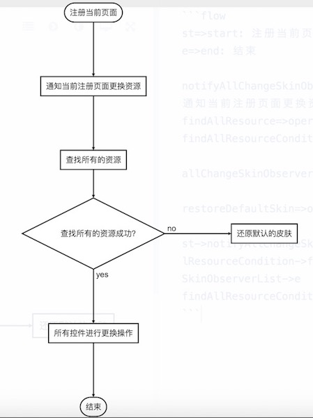

# andSkin 
支持应用内部换肤和外部插件换肤，目前支持background，src，textColor等属性，支持状态栏，方便扩展。
关于换肤原理的相关介绍见 [android 换肤](http://blog.csdn.net/zhi184816/article/details/53436761)
## 效果图
### 加载应用内的主题

### 加载应用外的主题

### 加载皮肤皮肤自动还原设置

## 优缺点
### 优点
- 相比较多换肤的框架，并没有侵入View的生成过程，仅仅只是占用了LayoutInflaterFactory，如果在使用中需要LayoutInflaterFactory，可以借助LayoutInflater其他的Factory
- 易于扩展，你只需要写下那个属性，另外在AttrFactory.java 注册即可
- 初始化外部资源失败后，会进行自动切换资源加载，选择上一套或者默认
- 能够选择是否开启更改状态栏的颜色
- 支持动态加载的view
- 更改起来方便，只需要在布局文件中的控件添加如下代码 
```
skin:enable="true"
```

### 缺点或者说应该注意地方
#### 在布局文件中，添加skin:enable="true"代码的控件必须申明<font color= "red">具有id属性</font>，否则不会更换
比如，对于下面两个控件，在换肤的时候并不会去更换资源的
```
<TextView
     android:layout_width="wrap_content"
     android:layout_height="wrap_content"
     android:textColor="@color/text_color_main"
     skin:enable="true" />
```
```
<TextView
     android:id="@+id/tv_main_content"
     android:layout_width="wrap_content"
     android:layout_height="wrap_content"
     android:textColor="@color/text_color_main"/>
```
#### 指定某个控件的单个/几个属性时，需要显示通过skin:attrs="src|background",默认不写的话，则按照attr支持所有的属性去检查，并生成相应属性对象，
比如对于ImageView，默认会生成src,background两个属性,即意味着，你在换肤的操作的时候，src和background各需要一套资源，即两者都需要更改，否则更换失败。
```
<ImageView
     android:id="@+id/iv_main_image"
     android:layout_width="wrap_content"
     android:layout_height="wrap_content"
     android:layout_gravity="center_horizontal"
     android:background="@drawable/bg_image_selector"
     android:clickable="true"
     android:src="@drawable/bg_image_selector"
     skin:enable="true"/>
```
下面这种只会生成一个src的属性，即换肤的时候，仅仅只有src更换，background并不会更换
```
<ImageView
     android:id="@+id/iv_main_image"
     android:layout_width="wrap_content"
     android:layout_height="wrap_content"
     android:layout_gravity="center_horizontal"
     android:background="@drawable/bg_image_selector"
     android:clickable="true"
     android:src="@drawable/bg_image_selector"
     skin:enable="true"
     skin:attrs="src"/>
```
同理，我们也可以设定background的属性，如下
```
<ImageView
     android:id="@+id/iv_main_image"
     android:layout_width="wrap_content"
     android:layout_height="wrap_content"
     android:layout_gravity="center_horizontal"
     android:background="@drawable/bg_image_selector"
     android:clickable="true"
     android:src="@drawable/bg_image_selector"
     skin:enable="true"
     skin:attrs="background"/>
```
#### 对于应用内部资源应该定义好后缀，并且应用内另一套资源名字为当前资源名字+后缀名字，而且要具有上述你所定义的所有要更换资源的资源文件。
例如，应用内部的默认名字为
```
    <color name="bg_main">#FFFFFF</color>
    <color name="text_color_main">#000000</color>
    <color name="status_bar_color">#000000</color>
    <color name="status_color">#000000</color>
```
则blue主题的资源文件为
```
    <color name="bg_main_blue">#444444</color>
    <color name="text_color_main_blue">#1111AA</color>
    <color name="status_bar_color_blue">#1111AA</color>
    <color name="status_color_blue">#0000FF</color>
```

 > <font color ="red">注意，对于更换资源包里，必须要包含所有要更换的资源属性，</font>比如，对于red主题来说,当加载red主题的时候，会失败，并且回退到上次的主题
 
 ```
     <color name="bg_main_red">#AAAAAA</color>
     <!--<color name="text_color_main_red">#AA2222</color>-->
     <color name="status_bar_color_red">#AA2222</color>
     <color name="status_color_red">#FF0000</color>
 ```
#### 对于外部资源包的时候，可以定义的原来的名字，也可以像更换应用内资源一样定义好后缀名字

#### 动态加载view
这里动态加载view，不只是addView的形式，而是在生成view的时候，比如listView的getView的方法,通常做法为
```
    if(contentView==null){
        contentView = LayoutInflater.from(context).inflate();
    }
```
这里通过inflat的时候加载view的时候，可以理解为广泛的动态加载view，类似的情况还有RecyclerView.onBindViewHolder以及Fragment.onCreateView等,这里需要将布局生成代码换成
```
convertView = baseSkinActivity.inflaterView(R.layout.item_main_list, parent, false);
```
内部实质是调用SkinLayoutInflater去解析xml布局可能存在需要更改的view

##如何使用
### 添加依赖 
gradle
```
compile 'com.rrtoyewx.andskinlibrary:andskinlibrary:1.0.0'
```
maven
```
<dependency>
  <groupId>com.rrtoyewx.andskinlibrary</groupId>
  <artifactId>andskinlibrary</artifactId>
  <version>1.0.0</version>
  <type>pom</type>
</dependency>
```

>2016.12.1 下午add to jcenter, 估计到2016.12.3 审核完

### 修改步骤
1.Application继承BaseSkinApplication
 对于已经继承其他的Application，可以将BaseSkinApplication的相关代码复制到你的Application中
 ```
    beforeInit();
    SkinLoader.getDefault().init(this);
    afterInit();
 ```
 
2.Activity继承BaseSkinActivity

3.确认当前Activity是否需要更换皮肤，如果对于当前页面，没有需要更改换肤的控件的时候，可以选择重载shouldRegister()的方法，默认追踪当前的页面所有的资源。
```
    protected boolean shouldRegister() {
            return true;
    }
```
4.确定当前的Activity在换肤的操作过程，是否需要更改状态栏的颜色,如果想要关闭，则可以选择重载shouldChangeStatusBarColor(),默认打开。
```
    protected boolean shouldChangeStatusBarColor() {
            return true;
    }
```
5.更换资源
```
    //更换应用内部的资源
    SkinLoader.loadSkin(String resourceSuffix);
    //更换外部包的资源
    SkinLoader.loadSkin(String pluginAPKPackageName,String pluginAPKPath,String resourceSuffix)
```
6.注册监听，监听换肤操作是否成功
```
    SkinLoader.addOnChangeSkinListener(OnChangeSkinListener listener)
```
 
 > 注册监听的对象会随着在注册监听时所处于页面的消失而被自动remove掉，这个是为了解决内存泄漏的问题
 
## 一些细节的说明
### 对于应用打开初始化的过程

<!--```flow-->
<!--st=>start: 初始化-->
<!--e=>end: loadSkinEnd-->

<!--DataManagerInit=>operation: DataManager初始化-->
<!--GlobalManagerInit=>operation: GlobalManager初始化-->
<!--ResourceManageInit=>operation: ResourceManage初始化-->

<!--generateResource=>operation: 生成Resource对象-->
<!--generateResourceCondition=>condition: Resource对象生成成功？-->

<!--onInitSuccess=>operation: 回调初始化成功的监听-->
<!--onInitError=>operation: 回调初始化失败的监听-->
<!--restoreDefaultSkin=>operation: 还原默认的皮肤-->

<!--st->DataManagerInit->GlobalManagerInit->ResourceManageInit->generateResource->generateResourceCondition(yes)->onInitSuccess->e-->

<!--generateResourceCondition(no)->onInitError->restoreDefaultSkin-->
<!--```-->
### 对于页面注册流程图

<!--```flow-->
<!--st=>start: 注册当前页面-->
<!--e=>end: 结束-->

<!--notifyAllChangeSkinObserverList=>operation: 通知当前注册页面更换资源-->
<!--findAllResource=>operation: 查找所有的资源-->
<!--findAllResourceCondition=>condition: 查找所有的资源成功？-->

<!--allChangeSkinObserverList=>operation: 所有控件进行更换操作-->

<!--restoreDefaultSkin=>operation: 还原默认的皮肤-->

<!--st->notifyAllChangeSkinObserverList->findAllResource->findAllResourceCondition->findAllResourceCondition(yes)->allChangeSkinObserverList->e-->
<!--findAllResourceCondition(no)->restoreDefaultSkin->-->
<!--```-->
### 对于应用启动后，点击换肤的流程图

<!--```flow-->
<!--st=>start: loadSkin-->
<!--e=>end: loadSkinEnd-->

<!--saveDataManager=>operation: DataManager存储需要换肤的相关信息-->
<!--saveDataManagerCondition=>condition:  DataManager存储信息成功？-->

<!--generateResource=>operation: 生成Resource对象-->
<!--generateResourceCondition=>condition: Resource对象生成成功？-->

<!--notifyAllChangeSkinObserverList=>operation: 通知所有注册页面更换资源-->
<!--findAllResource=>operation: 查找所有的资源-->
<!--findAllResourceCondition=>condition: 查找所有的资源成功？-->

<!--allChangeSkinObserverList=>operation: 所有控件进行更换操作-->

<!--restoreDefaultSkin=>operation: 还原默认的皮肤-->
<!--restoreLastSkin=>operation: 还原上一套的皮肤-->

<!--flushGlobalManagerInfos=>operation: 刷新GlobalManager关于资源的相关信息-->

<!--onLoadSkinError=>operation: 回调加载皮肤失败的监听-->

<!--onLoadSkinSuccess=>operation: 回调加载皮肤成功的监听-->

<!--st->saveDataManager->saveDataManagerCondition-->
<!--saveDataManagerCondition(yes)->generateResource->generateResourceCondition->generateResourceCondition(yes)->notifyAllChangeSkinObserverList->findAllResource->findAllResourceCondition->findAllResourceCondition(yes)->allChangeSkinObserverList->flushGlobalManagerInfos->onLoadSkinSuccess-->

<!--saveDataManagerCondition(no)->onLoadSkinError->restoreLastSkin->saveDataManager-->

<!--generateResourceCondition(no)->onLoadSkinError->restoreLastSkin->saveDataManager-->

<!--findAllResourceCondition(no)->onLoadSkinError->restoreLastSkin->saveDataManager-->
<!--```-->
> 说明</br>
1. restoreLastSkin或者restoreDefaultSkin都是一次loadSkin的过程
2. DataManager保存信息成功或者失败，成功是代表上一次资源相关信息和本次换肤的资源相关信息不一样，则需要保存，即为成功。反之则为失败</br>
3. 生成Resource对象成功或者失败，成功是指加载外部插件成功生成相应的Resources对象。</br>
4. 因为采用的是才查找资源再更换的操作，所有在当所有资源都查找成功，才会进行回调，如果存在任一一个资源查找不到，也会认为失败，对于这一点，想了很久业务上面，避免了页面过度重绘</br>
5. 对于应用打开还原上次资源失败后采用的是还原默认皮肤，而对于应用正常启动，换肤操作失败还原上一次皮肤。</br>
 
